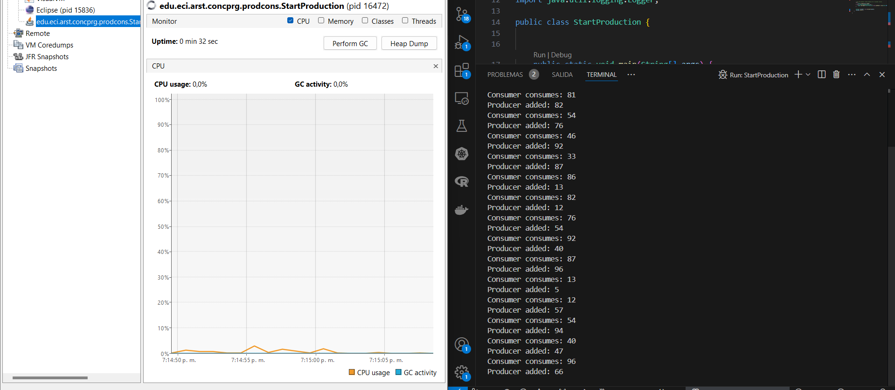

## Escuela Colombiana de Ingeniería
### Arquitecturas de Software – ARSW


#### Ejercicio – programación concurrente, condiciones de carrera y sincronización de hilos. EJERCICIO INDIVIDUAL O EN PAREJAS.

## Parte I 

Control de hilos con wait/notify. Productor/consumidor.

1. Revise el funcionamiento del programa y ejecútelo. Mientras esto ocurren, ejecute jVisualVM y revise el consumo de CPU del proceso correspondiente. A qué se debe este consumo?, cual es la clase responsable?
2. Haga los ajustes necesarios para que la solución use más eficientemente la CPU, teniendo en cuenta que -por ahora- la producción es lenta y el consumo es rápido. Verifique con JVisualVM que el consumo de CPU se reduzca.
3. Haga que ahora el productor produzca muy rápido, y el consumidor consuma lento. Teniendo en cuenta que el productor conoce un límite de Stock (cuantos elementos debería tener, a lo sumo en la cola), haga que dicho límite se respete. Revise el API de la colección usada como cola para ver cómo garantizar que dicho límite no se supere. Verifique que, al poner un límite pequeño para el 'stock', no haya consumo alto de CPU ni errores.


## DESARROLLO PARTE I

la clase responsable es consumer ya que realiza un bucle infinito cuando la cola esta vacia, como se muestra en la siguiente imagen 


Para utilizar eficientemente la cpu, podemos utilizar bloques sincronizados, para interrumpir los hilos hasta que el producer agregue mas elementos, y por consiguiente el producer debe notificar al consumer cuando hay nuevos elementos

### Clase Producer


### Clase Consumer


En lugar de ejecutar un bucle infinito, espera (wait()) hasta que el producer agregue un elemento.

Ahora veamos como el rendimiento se ve fuertemente reducido


Para lograr que el productor produzca mas rapido sobre la velocidad que tienen el consumidor de consumir, podemos aplicar lo siguiente:

Primero un limite de stock fijo, lo podemos lograr con una cola con capacidad limitada, se modificara el productor para que produzca elementos sin parar , de igual manera el consumidor se pausara antes de cada consumo


y asi sera su consumo, que sigue siendo significativamente mas bajo que la primera version



##### Parte II.

Teniendo en cuenta los conceptos vistos de condición de carrera y sincronización, haga una nueva versión -más eficiente- del ejercicio anterior (el buscador de listas negras). En la versión actual, cada hilo se encarga de revisar el host en la totalidad del subconjunto de servidores que le corresponde, de manera que en conjunto se están explorando la totalidad de servidores. Teniendo esto en cuenta, haga que:

- La búsqueda distribuida se detenga (deje de buscar en las listas negras restantes) y retorne la respuesta apenas, en su conjunto, los hilos hayan detectado el número de ocurrencias requerido que determina si un host es confiable o no (_BLACK_LIST_ALARM_COUNT_).
- Lo anterior, garantizando que no se den condiciones de carrera.


## DESARROLLO PARTE II 

Para este ejericio, debemos implementar diferentes clases que vamos a necesitar para manejar diferentes aspectos del problema en si mismo 

### Clase BlackListController

Esta clase nos va a permitir determinar si un Host debe considerarse confiable segun la cantidad de ocurrencias en la lista

```
package edu.eci.arst.concprg.prodcons;

public class BlackListController {
    

    private static final int AlarmCountBlackList = 5;
    private int ocurrencesCount = 0;

    public void InnerBlackListController (){
        
    }

    public synchronized boolean IncrementOcurrence(){
        boolean isvalid = false;
        if (ocurrencesCount<AlarmCountBlackList){
            ocurrencesCount++;
            isvalid = true;
        }

        return isvalid;
    }

    public synchronized boolean validate(){
        boolean isvalid = false;
        if(ocurrencesCount==AlarmCountBlackList){
            isvalid = true;
        }
        return isvalid;
    }
}


```

### Clase ThreadHostBlackLists

Esta clase es la implementación de un hilo que se encarga de buscar si una direccion esta en la lista negra , dentro de un rango de listas especificas

```
package edu.eci.arst.concprg.prodcons;

import java.util.ArrayList;
import java.util.List;


public class ThreadHostBlackLists extends Thread {
    private int a;
    private int b;
    private HostBlacklistsData SourceFacadeBlacklist;
    private int checkedListsCount = 0;
    private int ocurrencesCount = 0;
    private String ip;
    private final int BLACK_LIST_ALARM_COUNT = 5;
    private BlackListController controlador;
    private List<Integer> blacklistedServers; // Lista de servidores en blacklist

    public ThreadHostBlackLists(int a, int b, HostBlacklistsData SourceFacadeBlacklist, String ip, BlackListController controlador) {
        this.a = a;
        this.b = b;
        this.SourceFacadeBlacklist = SourceFacadeBlacklist;
        this.ip = ip;
        this.controlador = controlador;
        this.blacklistedServers = new ArrayList<>(); // Inicializa la lista
    }

    @Override
    public void run() {  
        for (int i = a; i <= b && ocurrencesCount < BLACK_LIST_ALARM_COUNT; i++) {
            checkedListsCount++;
            if (controlador.validate()) {
                break;
            }
            if (SourceFacadeBlacklist.isInBlackListServer(i, ip)) {
                blacklistedServers.add(i); // Agregar el servidor a la lista
                if (controlador.IncrementOcurrence()) {
                    ocurrencesCount++;
                } else {
                    break;
                }
            }
        }
    }

    public synchronized int getOcurrencesCount() {
        return ocurrencesCount;
    }

    public int getCheckedListsCount() {
        return checkedListsCount;
    }

    public List<Integer> getBlackListedServers() {
        return blacklistedServers; 
    }
}


```


### Clase HostBlacklistsData

Esta clase es la simulación de una base de datos de listas negras de servidores, Permite hacer la correcta verificación y registra la información sobre los accesos de los hilos que la consultan 

```
package edu.eci.arst.concprg.prodcons;

import java.util.Map;
import java.util.Objects;
import java.util.concurrent.ConcurrentHashMap;
import java.util.logging.Level;
import java.util.logging.Logger;

public class HostBlacklistsData {
    
    private static final Logger LOG = Logger.getLogger(HostBlacklistsData.class.getName());
    private static final HostBlacklistsData INSTANCE = new HostBlacklistsData();
    private static final ConcurrentHashMap<Tuple<Integer, String>, Object> BLACKLIST_OCCURRENCES = new ConcurrentHashMap<>();
    
    private final Map<String, Integer> threadHits = new ConcurrentHashMap<>();
    private String lastConfig = null;
    private int lastIndex = 0;

    static {
        Object anyObject = new Object();
        
        addToBlacklist(anyObject, "200.24.34.55", 23, 50, 200, 1000, 500);
        addToBlacklist(anyObject, "202.24.34.55", 29, 10034, 20200, 31000, 70500);
        addToBlacklist(anyObject, "202.24.34.54", 39, 10134, 20300, 70210);
    }
    
    private static void addToBlacklist(Object marker, String ip, Integer... serverNumbers) {
        for (Integer serverNumber : serverNumbers) {
            BLACKLIST_OCCURRENCES.put(new Tuple<>(serverNumber, ip), marker);
        }
    }
    
    private HostBlacklistsData() {}
    
    public static HostBlacklistsData getInstance() {
        return INSTANCE;
    }
    
    public int getRegisteredServersCount() {
        return 100000;
    }
    
    public boolean isInBlackListServer(int serverNumber, String ip) {
        threadHits.merge(Thread.currentThread().getName(), 1, Integer::sum);
        
        if (Boolean.parseBoolean(System.getProperty("threadsinfo"))) {
            lastConfig = threadHits.toString();
            lastIndex = serverNumber;
        }
        
        try {
            Thread.sleep(0, 1);
        } catch (InterruptedException ex) {
            LOG.log(Level.SEVERE, "Thread interrupted", ex);
            Thread.currentThread().interrupt();
        }
        
        return BLACKLIST_OCCURRENCES.containsKey(new Tuple<>(serverNumber, ip));
    }
    
    public void reportAsNotTrustworthy(String host) {
        LOG.info(() -> "HOST " + host + " reported as NOT trustworthy");
        
        if (Boolean.parseBoolean(System.getProperty("threadsinfo"))) {
            System.out.printf("Total threads: %d%n%s%nLast Index: %d%n",
                    threadHits.size(), lastConfig, lastIndex);
        }
    }
    
    public void reportAsTrustworthy(String host) {
        LOG.info(() -> "HOST " + host + " reported as trustworthy");
    }
}

class Tuple<T1, T2> {
    private final T1 firstElement;
    private final T2 secondElement;

    public Tuple(T1 firstElement, T2 secondElement) {
        this.firstElement = firstElement;
        this.secondElement = secondElement;
    }

    public T1 getFirstElement() {
        return firstElement;
    }

    public T2 getSecondElement() {
        return secondElement;
    }

    @Override
    public int hashCode() {
        return Objects.hash(firstElement, secondElement);
    }

    @Override
    public boolean equals(Object obj) {
        if (this == obj) return true;
        if (obj == null || getClass() != obj.getClass()) return false;
        Tuple<?, ?> other = (Tuple<?, ?>) obj;
        return Objects.equals(firstElement, other.firstElement) &&
               Objects.equals(secondElement, other.secondElement);
    }
}


```

### Clase HostBlackListsValidator

Esta clase utiliza concurrencia para acelerar la busqueda, con el fin de verificar si la direccion estan las listas negras 

```
package edu.eci.arst.concprg.prodcons;

import java.util.ArrayList;
import java.util.List;
import java.util.logging.Level;
import java.util.logging.Logger;

public class HostBlackListsValidator {

    private static final int BLACK_LIST_ALARM_COUNT = 5;
    private static final Logger LOG = Logger.getLogger(HostBlackListsValidator.class.getName());
    private final HostBlacklistsData skds = HostBlacklistsData.getInstance();
    
    public List<Integer> checkHost(String ipAddress, int numThreads) {
        int totalServers = skds.getRegisteredServersCount();
        int rangePerThread = totalServers / numThreads;
        int remainder = totalServers % numThreads;
        
        List<ThreadHostBlackLists> threads = new ArrayList<>();
        BlackListController controller = new BlackListController();
        
        for (int i = 0; i < numThreads; i++) {
            int start = i * rangePerThread + Math.min(i, remainder);
            int end = start + rangePerThread + (i < remainder ? 1 : 0) - 1;
            
            ThreadHostBlackLists thread = new ThreadHostBlackLists(start, end, skds, ipAddress, controller);
            threads.add(thread);
            thread.start();
        }
        
        List<Integer> blackListOccurrences = new ArrayList<>();
        int occurrencesCount = 0;
        int checkedListsCount = 0;
        
        for (ThreadHostBlackLists thread : threads) {
            try {
                thread.join();
                occurrencesCount += thread.getOcurrencesCount();
                checkedListsCount += thread.getCheckedListsCount();
                blackListOccurrences.addAll(thread.getBlackListedServers());
            } catch (InterruptedException e) {
                LOG.log(Level.SEVERE, "Thread interrupted", e);
            }
        }
        
        if (occurrencesCount >= BLACK_LIST_ALARM_COUNT) {
            skds.reportAsNotTrustworthy(ipAddress);
        } else {
            skds.reportAsTrustworthy(ipAddress);
        }
        
        LOG.log(Level.INFO, "Checked Black Lists: {0} of {1}", new Object[]{checkedListsCount, totalServers});
        
        return blackListOccurrences;
    }
}

```
Finalmente la clase main.

### Clase main

```

package edu.eci.arst.concprg.prodcons;

import java.util.List;

public class BlackListMain {
    
    private static final String TARGET_IP = "202.24.34.55";
    private static final int THREAD_COUNT = 50;

    public static void main(String[] args) {
        HostBlackListsValidator validator = new HostBlackListsValidator();
        List<Integer> blackListOccurrences = validator.checkHost(TARGET_IP, THREAD_COUNT);

        System.out.println(String.format("El host %s fue encontrado en las siguientes listas negras: %s", 
                                          TARGET_IP, blackListOccurrences));

        int availableProcessors = Runtime.getRuntime().availableProcessors();
        System.out.println(String.format("Número de núcleos disponibles: %d", availableProcessors));
    }
}

```

### Pruebas de funcionamiento


##### Parte III. – Avance para el martes, antes de clase.

Sincronización y Dead-Locks.


1. Revise el programa “highlander-simulator”, dispuesto en el paquete edu.eci.arsw.highlandersim. Este es un juego en el que:

	* Se tienen N jugadores inmortales.
	* Cada jugador conoce a los N-1 jugador restantes.
	* Cada jugador, permanentemente, ataca a algún otro inmortal. El que primero ataca le resta M puntos de vida a su contrincante, y aumenta en esta misma cantidad sus propios puntos de vida.
	* El juego podría nunca tener un único ganador. Lo más probable es que al final sólo queden dos, peleando indefinidamente quitando y sumando puntos de vida.

2. Revise el código e identifique cómo se implemento la funcionalidad antes indicada. Dada la intención del juego, un invariante debería ser que la sumatoria de los puntos de vida de todos los jugadores siempre sea el mismo(claro está, en un instante de tiempo en el que no esté en proceso una operación de incremento/reducción de tiempo). Para este caso, para N jugadores, cual debería ser este valor?.

3. Ejecute la aplicación y verifique cómo funcionan las opción ‘pause and check’. Se cumple el invariante?.

4. Una primera hipótesis para que se presente la condición de carrera para dicha función (pause and check), es que el programa consulta la lista cuyos valores va a imprimir, a la vez que otros hilos modifican sus valores. Para corregir esto, haga lo que sea necesario para que efectivamente, antes de imprimir los resultados actuales, se pausen todos los demás hilos. Adicionalmente, implemente la opción ‘resume’.

5. Verifique nuevamente el funcionamiento (haga clic muchas veces en el botón). Se cumple o no el invariante?.

6. Identifique posibles regiones críticas en lo que respecta a la pelea de los inmortales. Implemente una estrategia de bloqueo que evite las condiciones de carrera. Recuerde que si usted requiere usar dos o más ‘locks’ simultáneamente, puede usar bloques sincronizados anidados:

	```java
	synchronized(locka){
		synchronized(lockb){
			…
		}
	}
	```

7. Tras implementar su estrategia, ponga a correr su programa, y ponga atención a si éste se llega a detener. Si es así, use los programas jps y jstack para identificar por qué el programa se detuvo.

8. Plantee una estrategia para corregir el problema antes identificado (puede revisar de nuevo las páginas 206 y 207 de _Java Concurrency in Practice_).

9. Una vez corregido el problema, rectifique que el programa siga funcionando de manera consistente cuando se ejecutan 100, 1000 o 10000 inmortales. Si en estos casos grandes se empieza a incumplir de nuevo el invariante, debe analizar lo realizado en el paso 4.

10. Un elemento molesto para la simulación es que en cierto punto de la misma hay pocos 'inmortales' vivos realizando peleas fallidas con 'inmortales' ya muertos. Es necesario ir suprimiendo los inmortales muertos de la simulación a medida que van muriendo. Para esto:
	* Analizando el esquema de funcionamiento de la simulación, esto podría crear una condición de carrera? Implemente la funcionalidad, ejecute la simulación y observe qué problema se presenta cuando hay muchos 'inmortales' en la misma. Escriba sus conclusiones al respecto en el archivo RESPUESTAS.txt.
	* Corrija el problema anterior __SIN hacer uso de sincronización__, pues volver secuencial el acceso a la lista compartida de inmortales haría extremadamente lenta la simulación.

11. Para finalizar, implemente la opción STOP.


## DESARROLLO PARTE 3

2. Podemos concluir que cada inmortal es un hilo independiente, cada hilo independiente, selecciona de manera aleatoria a quien atacar.
La funcionalidad clave esta en el metodo fight(),segun la hipotesis de que el invariante es la suma total de la vida de todos los inmortales deber ser constante, entonces podemos inferir que para N jugadores, el valor es

```
N X 100

```


<!--
### Criterios de evaluación

1. Parte I.
	* Funcional: La simulación de producción/consumidor se ejecuta eficientemente (sin esperas activas).

2. Parte II. (Retomando el laboratorio 1)
	* Se modificó el ejercicio anterior para que los hilos llevaran conjuntamente (compartido) el número de ocurrencias encontradas, y se finalizaran y retornaran el valor en cuanto dicho número de ocurrencias fuera el esperado.
	* Se garantiza que no se den condiciones de carrera modificando el acceso concurrente al valor compartido (número de ocurrencias).


2. Parte III.
	* Diseño:
		- Coordinación de hilos:
			* Para pausar la pelea, se debe lograr que el hilo principal induzca a los otros a que se suspendan a sí mismos. Se debe también tener en cuenta que sólo se debe mostrar la sumatoria de los puntos de vida cuando se asegure que todos los hilos han sido suspendidos.
			* Si para lo anterior se recorre a todo el conjunto de hilos para ver su estado, se evalúa como R, por ser muy ineficiente.
			* Si para lo anterior los hilos manipulan un contador concurrentemente, pero lo hacen sin tener en cuenta que el incremento de un contador no es una operación atómica -es decir, que puede causar una condición de carrera- , se evalúa como R. En este caso se debería sincronizar el acceso, o usar tipos atómicos como AtomicInteger).

		- Consistencia ante la concurrencia
			* Para garantizar la consistencia en la pelea entre dos inmortales, se debe sincronizar el acceso a cualquier otra pelea que involucre a uno, al otro, o a los dos simultáneamente:
			* En los bloques anidados de sincronización requeridos para lo anterior, se debe garantizar que si los mismos locks son usados en dos peleas simultánemante, éstos será usados en el mismo orden para evitar deadlocks.
			* En caso de sincronizar el acceso a la pelea con un LOCK común, se evaluará como M, pues esto hace secuencial todas las peleas.
			* La lista de inmortales debe reducirse en la medida que éstos mueran, pero esta operación debe realizarse SIN sincronización, sino haciendo uso de una colección concurrente (no bloqueante).

	

	* Funcionalidad:
		* Se cumple con el invariante al usar la aplicación con 10, 100 o 1000 hilos.
		* La aplicación puede reanudar y finalizar(stop) su ejecución.
		
		-->

<a rel="license" href="http://creativecommons.org/licenses/by-nc/4.0/"></a><br />Este contenido hace parte del curso Arquitecturas de Software del programa de Ingeniería de Sistemas de la Escuela Colombiana de Ingeniería, y está licenciado como <a rel="license" href="http://creativecommons.org/licenses/by-nc/4.0/">Creative Commons Attribution-NonCommercial 4.0 International License</a>.
